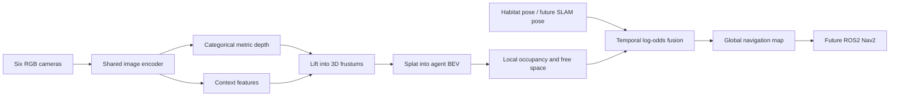

# Six-Camera Lift-Splat-Shoot BEV Mapping in Habitat

An RGB-only bird's-eye-view (BEV) perception and mapping prototype for indoor
robot navigation. Six synchronized Habitat cameras surround the agent, a
depth-supervised Lift-Splat-Shoot model predicts a local occupancy grid, and
successive predictions are fused into a persistent global map.

The current implementation runs interactively in Habitat-Sim on Apple Silicon
using PyTorch MPS. ROS2/Nav2 integration is the next project stage.

## What works

- Six synchronized RGB cameras with 360-degree horizontal coverage
- Habitat metric-depth recording for supervised training
- 14-channel, 10 m x 10 m BEV targets at 0.1 m resolution
- Learned categorical depth and BEV occupancy from RGB only
- Block-stratified train, validation, and test splits
- RGB photometric augmentation
- Navigation-focused occupancy, boundary, and Dice loss
- Validation previews and held-out evaluation
- Interactive Habitat inference and global temporal BEV fusion
- MPS/CUDA/CPU device selection and latency benchmarking

## System overview



The live Habitat demo currently uses the simulator's exact pose as a stand-in
for SLAM. On a robot, SLAM or odometry will supply that transform while the
learned BEV supplies local obstacle evidence.

## Current results

Best-IoU checkpoint from epoch 17 of the depth-supervised, RGB-augmented run:

| Metric | Held-out test result |
|---|---:|
| Occupancy IoU | 0.5615 |
| Precision | 0.7251 |
| Recall | 0.7133 |
| Depth MAE | 0.424 m |
| Model-only latency | 36.97 ms |
| Model-only throughput | 27.05 FPS |

Latency was measured for six RGB images to BEV on an Apple M4 with the MPS
backend. These are held-out temporal-block results from HSSD scene `102344280`,
not an unseen-scene benchmark. Multi-scene training and scene-level evaluation
remain required before claiming general indoor generalization.

## BEV output

The model returns `[B, 14, 100, 100]`. Each grid cell covers 0.1 m, spanning
five metres in every direction around the agent.

| Channels | Meaning |
|---|---|
| 0 | Occupied |
| 1 | Free space |
| 2 | Observed |
| 3-9 | Seven vertical occupancy bins |
| 10 | Minimum observed obstacle height |
| 11 | Maximum observed obstacle height |
| 12 | Average observed obstacle height |
| 13 | Normalized point density |

Habitat camera coordinates are converted from computer-vision coordinates
before splatting: CV `(+x right, +y down, +z forward)` becomes Habitat
`(+x right, +y up, -z forward)`.

## Repository structure

```text
habitat/       Habitat recording, target generation, inspection, and live demo
habitat_lss/   Habitat dataset, model, training, evaluation, and benchmarking
lss/           Image encoder and Lift-Splat-Shoot geometry
train/         Earlier nuScenes training experiments and utilities
utils/         Dataset and camera-geometry helpers
mujoco/        Separate MuJoCo environment experiments
src/           Earlier project entry points
```

## Environment

Known-working development environment:

- Python 3.9.23
- Habitat-Sim 0.3.3
- PyTorch 2.8.0
- NumPy 1.26.4
- OpenCV 4.10.0
- Matplotlib 3.9.4
- numpy-quaternion 2023.0.4

Create and activate an environment, install the Python dependencies, and then
install Habitat-Sim 0.3.3 using the method appropriate for your platform.

```bash
conda create -n habitat_env python=3.9
conda activate habitat_env
python -m pip install -r requirements.txt
```

Verify the simulator separately:

```bash
python -c "import habitat_sim; print('Habitat-Sim import succeeded')"
```

On macOS, the project intentionally imports OpenCV before PyTorch in training
entry points. Changing that order can initialize two OpenMP runtimes and abort
the process.

## HSSD data

HSSD assets are not included in this repository. Download them under their own
license and arrange the relevant files like this:

```text
data/habitat/versioned_data/hssd-hab/
├── hssd-hab.scene_dataset_config.json
├── scenes/
├── stages/
├── objects/
└── materials/
```

The example commands use scene `102344280`.

## End-to-end workflow

Run commands from the repository root.

### 1. Record synchronized Habitat data

```bash
python -m habitat.record_six_camera_dataset \
  --scene 102344280 \
  --dataset data/habitat/versioned_data/hssd-hab/hssd-hab.scene_dataset_config.json \
  --sequence sequence_0000
```

Recorder controls:

- `W/S`: move forward/backward
- `A/D`: turn left/right
- `E`: force-save a frame
- `R`: start a new segment at a random navigable position
- `P`: print the current pose
- `Q` or `Esc`: finish

Record additional sequences with new names instead of overwriting an existing
manifest.

### 2. Generate BEV targets

```bash
python -m habitat.build_bev_dataset \
  --dataset-root outputs/habitat_dataset/scene_102344280
```

The targets are generated from recorded Habitat depth and poses. Ground-truth
depth is used only to create labels and supervise training; live inference uses
the six RGB images.

### 3. Inspect one recorded sample

```bash
python -m habitat.inspect_recorded_dataset \
  outputs/habitat_dataset/scene_102344280/sequence_0000 \
  --frame 0
```

### 4. Run the depth smoke test

```bash
python -m habitat_lss.habitat_depth_smoke_test \
  --dataset-root outputs/habitat_dataset/scene_102344280
```

This verifies tensor shapes, depth coverage, losses, and finite gradients
before a long training run.

### 5. Train with the navigation-focused loss

Fresh training:

```bash
python -m habitat_lss.habitat_train_depth_v2 \
  --dataset-root outputs/habitat_dataset/scene_102344280 \
  --output-dir outputs/habitat_lss_navigation_v2 \
  --epochs 30 \
  --batch-size 1 \
  --depth-loss-weight 0.20 \
  --augment-rgb \
  --live-preview \
  --validation-previews 3
```

To fine-tune a compatible checkpoint, add:

```text
--resume outputs/habitat_lss_depth_augmented/habitat_lss_depth_best_iou.pt
```

The best validation-IoU checkpoint is written to:

```text
outputs/habitat_lss_navigation_v2/habitat_lss_depth_best_iou.pt
```

### 6. Evaluate and visualize

```bash
python -m habitat.habitat_showcase \
  --dataset-root outputs/habitat_dataset/scene_102344280 \
  --checkpoint outputs/habitat_lss_navigation_v2/habitat_lss_depth_best_iou.pt \
  --split test \
  --samples 6
```

When no threshold is supplied, the showcase selects one using validation IoU
and then evaluates the chosen threshold on the requested split.

### 7. Benchmark inference

```bash
python -m habitat_lss.habitat_benchmark \
  --dataset-root outputs/habitat_dataset/scene_102344280 \
  --checkpoint outputs/habitat_lss_navigation_v2/habitat_lss_depth_best_iou.pt
```

The benchmark reports model-only latency separately from disk loading and
preprocessing latency.

### 8. Run live Habitat BEV mapping

```bash
python -m habitat.habitat_live_bev \
  --scene 102344280 \
  --scene-dataset-config data/habitat/versioned_data/hssd-hab/hssd-hab.scene_dataset_config.json \
  --reference-sequence outputs/habitat_dataset/scene_102344280/sequence_0000 \
  --checkpoint outputs/habitat_lss_navigation_v2/habitat_lss_depth_best_iou.pt \
  --occupancy-threshold 0.50
```

Live controls:

- `W/S`: move
- `A/D`: turn
- `R`: random navigable position
- `C`: clear the accumulated global map
- `Q` or `Esc`: close

The left panels show the six RGB cameras, the centre-bottom panel shows the
current agent-relative occupancy probability, and the right-bottom panel shows
the accumulated global BEV map. Habitat's exact agent pose currently provides
the world transform.

## ROS2 and Nav2 roadmap

The intended deployment interface is:

1. Subscribe to six synchronized RGB camera topics.
2. Run RGB-to-BEV inference in a ROS2 node.
3. Receive `map -> odom -> base_link` from SLAM/localization.
4. Transform local BEV evidence into the `map` frame.
5. Publish a `nav_msgs/OccupancyGrid` and/or a Nav2 obstacle layer.
6. Use Nav2 for global planning and local collision avoidance.

The learned depth head should initially support perception, not replace
localization. A real depth camera, lidar, wheel odometry, IMU, or visual-inertial
odometry is preferable for SLAM pose estimation. This separation prevents
perception hallucinations from directly producing localization drift.

## Known limitations

- Training and reported testing currently use one HSSD scene.
- Predicted depth is lower-resolution and less precise than a physical depth
  sensor.
- The global demo uses perfect Habitat pose rather than estimated SLAM pose.
- Dynamic obstacles have not yet been modeled explicitly.
- Temporal fusion does not yet decay stale occupied cells.
- No ROS2 message or TF integration is included yet.

## Recommended next experiments

1. Record at least 5-10 HSSD scenes.
2. Split validation and test data by complete scene, not only temporal block.
3. Evaluate occupancy IoU, precision, recall, depth MAE, and map consistency on
   unseen scenes.
4. Add confidence decay and dynamic-obstacle handling to temporal fusion.
5. Implement the ROS2 BEV inference and occupancy-fusion nodes.

## Data and licensing

Do not commit HSSD assets, generated RGB/depth recordings, BEV targets, or
trained checkpoints. HSSD remains subject to its own license and distribution
terms.

This repository does not currently contain a project license. Add a compatible
license before describing the repository as open source or accepting external
reuse. Confirm compatibility with any upstream Lift-Splat-Shoot code first.

## References

- [Lift, Splat, Shoot: Encoding Images from Arbitrary Camera Rigs by Explicitly Unprojecting to 3D](https://arxiv.org/abs/2008.05711)
- [Habitat-Sim](https://github.com/facebookresearch/habitat-sim)
- [HSSD: Habitat Synthetic Scenes Dataset](https://3dlg-hcvc.github.io/hssd/)
- [ROS 2](https://docs.ros.org/)
- [Nav2](https://docs.nav2.org/)

